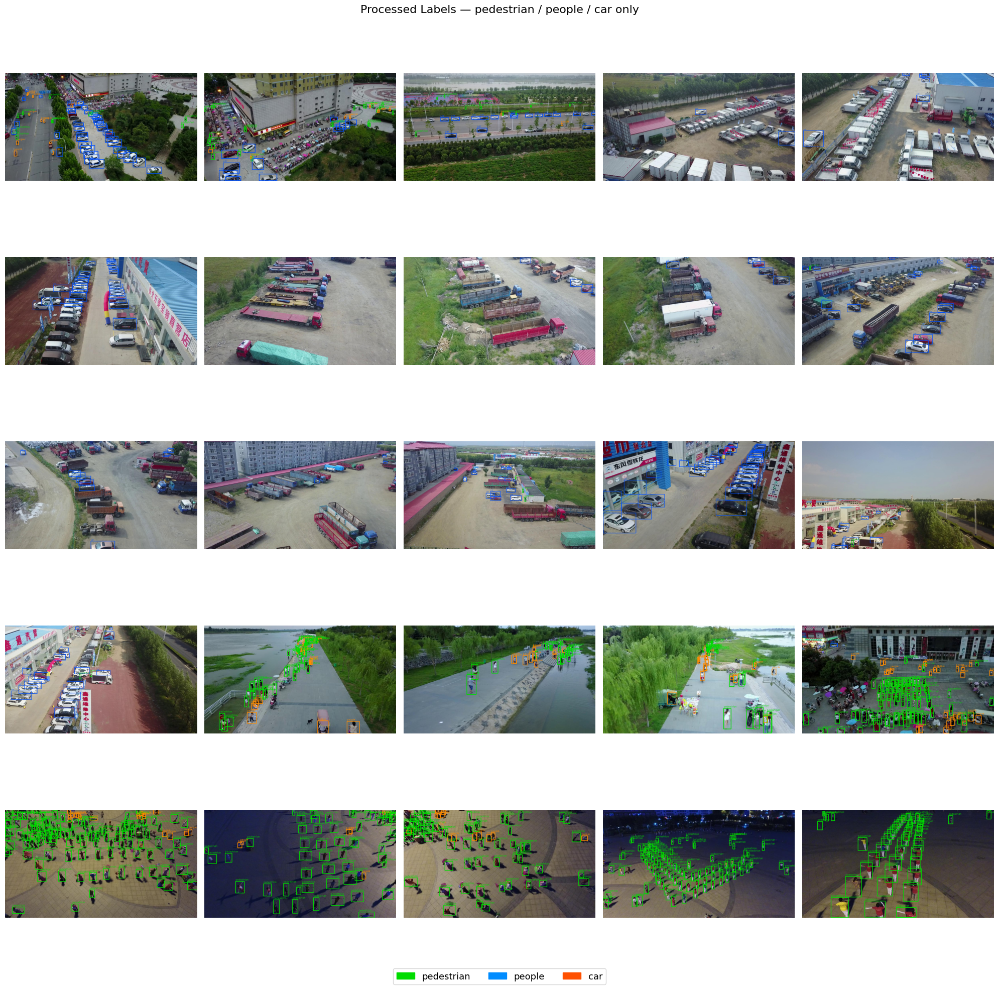
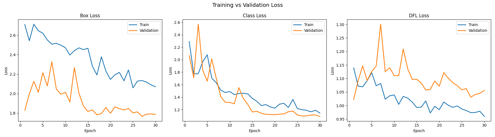
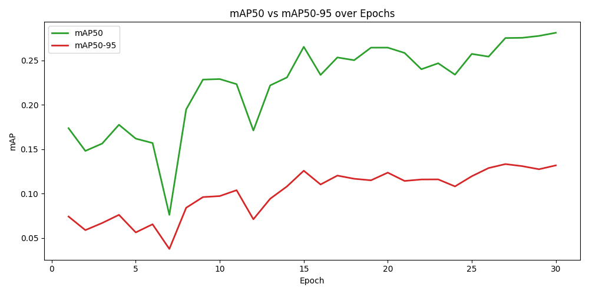

# 🚁 Drone Human Detection & Counting System

<div align="center">


**Fine-tuned YOLOv8s for detecting and counting humans and vehicles from drone imagery**

[Features](#-features) • [Architecture](#-architecture) • [Installation](#-installation) • [Dataset](#-dataset-setup) • [Training](#-training) • [Inference](#-inference) • [Results](#-results) • [Future Work](#-future-improvements)

</div>

---

## 📌 Project Overview

This project builds a **real-time human detection and counting system** for drone/UAV imagery using the **VisDrone2019** dataset and **YOLOv8s** fine-tuned for aerial object detection.

Drone-based detection is significantly harder than ground-level detection because:
- Objects appear as **tiny 10–30 pixel blobs** from 50–100m altitude
- **High crowd density** — 100+ people can appear in a single frame
- **Heavy occlusion** — people overlap each other
- **Varying altitude** — same person looks very different at different heights
- **Camera motion** — drone movement introduces blur and perspective shifts

This project addresses all of these challenges through careful preprocessing, augmentation strategy, and model selection.

---

## ✨ Features

- ✅ Fine-tuned **YOLOv8s** on VisDrone2019 (pedestrian, people, car)
- ✅ **Class filtering and remapping** pipeline (10 → 3 classes)
- ✅ **Exploratory Data Analysis** with class distribution and object size plots
- ✅ **Human counting** per image — separates pedestrian + people classes
- ✅ **Training curves** — loss, mAP50, mAP50-95, Precision-Recall
- ✅ **Evaluation metrics** — mAP50, mAP50-95, Precision, Recall on test set
- ✅ **7×7 prediction grid** visualization for demo
- ✅ Modular, readable Python code — one file per task
- ✅ Jupyter Notebook version for interactive exploration

---

## 🏗️ Architecture

### Project Structure

```
drone-human-detection-system/
│
├── data/
│   ├── raw/                        # Original VisDrone dataset
│   │   ├── VisDrone2019-DET-train/
│   │   │   ├── images/
│   │   │   └── labels/
│   │   ├── VisDrone2019-DET-val/
│   │   │   ├── images/
│   │   │   └── labels/
│   │   └── VisDrone2019-DET-test-dev/
│   │       ├── images/
│   │       └── labels/
│   ├── processed/                  
│   │   ├── train/labels/
│   │   ├── val/labels/
│   │   └── test/labels/
│   └── dataset.yaml                
│
├── src/
│   ├── config.py                   # All paths and constants
│   ├── dataset.py                  # Label preprocessing pipeline
│   ├── eda.py                      # Exploratory Data Analysis + visualization
│   ├── train.py                    # YOLOv8 training script
│   ├── plot_results.py             # Training curve plots
│   ├── detect.py                   # Inference + human counting
│   └── visualize_grid.py           # 7×7 prediction grid
│
├── evaluation/
│   └── evaluate.py                 # mAP, Precision, Recall on test set
│
├── models/
│   ├── pretrained/                 # Base YOLOv8 weights
│   └── finetuned/                  # Your trained weights (not tracked by git)
│       └── visdrone_yolov8s/
│           └── weights/
│               └── best.pt
│
├── notebooks/
│   └── drone_detection.ipynb       # Full pipeline in Jupyter
│
├── outputs/
│   ├── plots/                      # EDA charts, training curves, grids
│   ├── predictions/                # Annotated inference images
│   └── metrics/                    # Evaluation CSVs
│
├── config.yaml                     # Project configuration
├── requirements.txt                # Python dependencies
└── README.md
```

### Model Pipeline

```
VisDrone Images (1920×1080)
        ↓
  Label Preprocessing
  (filter 10 → 3 classes, remap IDs)
        ↓
  YOLOv8s Fine-tuning
  (pretrained COCO → VisDrone)
        ↓
  Inference (640×640)
        ↓
  ┌─────────────┬──────────────┐
  │  Detection  │   Counting   │
  │  (boxes)    │  (humans)    │
  └─────────────┴──────────────┘
        ↓
  Annotated Output
```

### Class Mapping

| Original VisDrone ID | Class Name | New YOLO ID | Role |
|:---:|:---:|:---:|:---:|
| 0 | pedestrian | 0 | Human ✅ |
| 1 | people | 1 | Human ✅ |
| 3 | car | 2 | Vehicle ✅ |
| 2,4,5,6,7,8,9 | others | — | Removed ❌ |

---

## ⚙️ Installation

### 1. Clone the repository

```bash
git clone https://github.com/swe-dipu/drone-human-detection-system.git
cd drone-human-detection-system
```

### 2. Create conda environment

```bash
conda create -n dronenet python=3.10 -y
conda activate dronenet
```

### 3. Install PyTorch (CPU)

```bash
pip install torch torchvision torchaudio --index-url https://download.pytorch.org/whl/cpu
```

### 4. Install all dependencies

```bash
pip install -r requirements.txt
```

### 5. Verify installation

```bash
python -c "from ultralytics import YOLO; print('Setup OK')"
```

---

## 📦 Dataset Setup

**Dataset:** [VisDrone2019-DET](https://www.kaggle.com/datasets/banuprasadb/visdrone-dataset) — aerial imagery captured by drone cameras.

| Split | Images | Description |
|:---:|:---:|:---|
| Train | 6,471 | Main training set |
| Validation | 548 | Hyperparameter tuning |
| Test | 1,610 | Final evaluation |

### Download and place the dataset

1. Download from [Kaggle — VisDrone Dataset](https://www.kaggle.com/datasets/banuprasadb/visdrone-dataset)

2. Extract and organize as:

```
data/raw/
├── VisDrone2019-DET-train/
│   ├── images/
│   └── labels/
├── VisDrone2019-DET-val/
│   ├── images/
│   └── labels/
└── VisDrone2019-DET-test-dev/
    ├── images/
    └── labels/
```

> **Note:** The `data/raw/` folder is excluded from git (see `.gitignore`) due to dataset size (~2GB).

---

## 🚀 Training

Run each script in order:

### Step 1 — Preprocess Labels

```bash
python src/dataset.py
```

Filters VisDrone labels to 3 classes, remaps IDs, saves to `data/processed/`, generates `data/dataset.yaml`.

### Step 2 — Exploratory Data Analysis

```bash
python src/eda.py
```

Produces 3 plots in `outputs/plots/`:
- `raw_samples.png` — sample images with all original classes
- `class_distribution.png` — object counts per class per split
- `processed_samples.png` — samples after filtering (sanity check)

### Step 3 — Train YOLOv8s

```bash
python src/train.py
```

| Setting | Value |
|:---:|:---:|
| Model | YOLOv8s (pretrained COCO) |
| Epochs | 30 |
| Batch size | 4 |
| Image size | 640×640 |
| Device | CPU |

Weights saved to `models/finetuned/visdrone_yolov8s/weights/best.pt`

### Step 4 — Plot Training Results

```bash
python src/plot_results.py
```

Saves loss curves, mAP chart, and Precision-Recall scatter to `outputs/plots/`.

---

## 🔍 Inference

### Run detection + human counting

```bash
python src/detect.py
```

Runs inference on 15 test images. Prints human and car count per image. Saves annotated images to `outputs/predictions/`.

### Generate prediction grid

```bash
python src/visualize_grid.py
```

Saves a 7×7 grid of annotated test images to `outputs/plots/grid_predictions.png`.

### Or use the Jupyter Notebook

```bash
jupyter notebook notebooks/drone_detection.ipynb
```

---

## 📊 Results

### Evaluation Metrics

Run on the test set after training:

```bash
python evaluation/evaluate.py
```

| Metric | Value |
|:---|:---:|
| mAP@50 | — *(update after training)* |
| mAP@50-95 | — *(update after training)* |
| Precision | — *(update after training)* |
| Recall | — *(update after training)* |

> Fill in your actual numbers from `python evaluation/evaluate.py` after training completes.

### Sample Predictions

<!-- After training, replace these with your actual output images -->
<!-- Drag and drop outputs/plots/processed_samples.png here -->

**Processed Labels (sanity check):**



**Prediction Grid:**


**Training Curves:**





---

## 🧪 Why VisDrone is Hard

| Challenge | Impact | Our Solution |
|:---|:---|:---|
| Tiny objects (10–30px) | Model misses small people | Fine-tune at 640px + data augmentation |
| High crowd density | Overlapping boxes | Mosaic augmentation + low NMS threshold |
| Class imbalance | Rare classes underperform | Keep only 3 relevant classes |
| Scale variation | Different altitudes | YOLOv8 multi-scale feature pyramid |
| Motion blur | Blurry detections | HSV + blur augmentations |

---

## 🔧 Configuration

All settings live in `src/config.py`:

```python
EPOCHS     = 30       # training epochs
BATCH_SIZE = 4        # keep small for CPU
IMG_SIZE   = 640      # YOLO input resolution
CONF       = 0.25     # detection confidence threshold
DEVICE     = 'cpu'    # change to '0' for GPU
```


## 📁 Key Files Reference

| File | Purpose |
|:---|:---|
| `src/config.py` | All paths, class names, training settings |
| `src/dataset.py` | Preprocess VisDrone labels |
| `src/eda.py` | EDA visualizations |
| `src/train.py` | Train YOLOv8s |
| `src/plot_results.py` | Plot training curves |
| `src/detect.py` | Inference + human counting |
| `src/visualize_grid.py` | 7×7 prediction grid |
| `evaluation/evaluate.py` | mAP, Precision, Recall |
| `notebooks/drone_detection.ipynb` | Full pipeline in one notebook |

---


---

## 🙋 Author

**Dipu Ghosh**
GitHub: [@swe-dipu](https://github.com/swe-dipu)

---

<div align="center">
⭐ Star this repo if you found it helpful!
</div>
